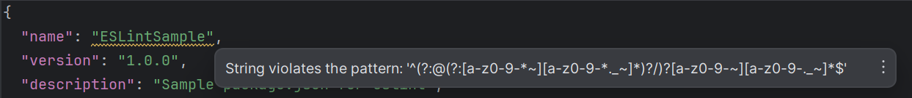

pre code {
  background-color: #eee;
  border: 1px solid #999;
  display: block;
  padding: 20px;
}

## Introduction
  To many, coding standards are nothing but mundane rules getting in the way of one's creative coding mind. 

  "*Why single quotes instead of double quotes?*" 
  
  "*Why two space indents instead of four?*"
  
  These are questions that I remember asking myself when learning to code by our class coding standards.
  
  While I agree that some coding standards seem trivial and unnecessary, I would argue that they are a fundamental aspect of software engineering, that can create clarity out of a chaotic mess of code.

## Section 1: Chaos
  Take a few moments to figure out what the following function f() does:
  
<pre>
  <code>
  function f(a){let r=0;for(let i=0;i<a.length;i++){r+=a[i];}if(r>10){console.log("r>10");}else{console.log("r<=10");}}let arr=[1,2,3,4,5];f(arr);
</code>
</pre>  

  One of five things should be true now that you are reading this:
  1. You skipped over the code (or even my whole intro)
  2. You had the courage to try but ultimately gave up
  3. You copied and pasted the code, rewriting it to follow coding standards
  4. You are a genius who got it right and have no business reading this essay
  5. You asked ChatGPT

  This is a valid and working function, so why is the code so hard to decipher? Including newlines may not be considered to some as a coding standard, but I would argue it is so engrained into coding culture that it is part of some unspoken universal coding standard. These standards are expected because they make the code  **readable**, which is the golden word when it comes to the importance coding standards.

  
## Section 2: Clutter
  Here is the same code from the previous section, but with newlines.

<pre>
  <code>
    function f(a) {
      let r = 0;
        for (let i = 0; i < a.length; i++) {
          r += a[i];
        }
        if (r > 10) {
          console.log("r>10");
        } else {
          console.log("r<=10");
        }
    }
    let arr = [1, 2, 3, 4, 5];
    f(arr);
  </code>
</pre>

  We are now approaching readability, but the code is missing another factor that makes good coding standards; it is not  **learnable**. Here we can see generally what is going on, but because of the lack of naming convention, we have no context to the actual purpose of the function. Naming convention is one of the first aspects of coding standard that is emphasized in coding classrooms. Why? Because the goal in the classroom is to learn.

## Section 3: Clarity
Let's finally take a look at some code with good coding standards.

<pre>
  <code>
    function calculateSum(array) {
      let sum = 0;
      for (let i = 0; i < array.length; i++) {
        sum += array[i];
      }
    
      if (sum > 10) {
        console.log("Sum is greater than 10");
      } else {
        console.log("Sum is less than or equal to 10");
      }
    }

    let numbers = [1, 2, 3, 4, 5];
    calculateSum(numbers);
  </code>
</pre>

It looks like an entirely different function. In this version, the function and variable names are descriptive, adhering to the camelCase naming convention. There is now proper indentation and spacing to enhance its readability. Comments could be added for further clarity, but even without them, the code is significantly easier to understand compared to the original mess in section 1. Most importantly, if another programmer were to pick up this code and modify it, they would have no problems understanding the functions purpose, showing the importance of coding standards when collaborating with a team.

## Section 4: Thoughts on ESLint in IntelliJ
  So far, ESLint has treated me well. It is very easy to correct coding standard mistakes, as a quick hover over the mistake and a click on the 'Quick-Fix' option will typically get rid of the warning. There are some warning that don't have quick-fixes, but they still have a description of what is wrong. Getting a green checkmark has been no problem at all, and sometimes the errors picked out by ESLint fix the functionality of the code. Some of the class coding standards feel a bit unnecessary, such as single-quotes, two space indents, and no multiple spaces seem unnecessary, but some optimize file size, which can be helpful when dealing with large files. ESLint so far has led to an easy debugging experience despite some of the class coding standards being somewhat trivial, and I look forward to seeing what it has to suggest for me next.

Unless it looks like this:

  

## Conclusion
Coding standards serve as the cornerstone of software engineering, transforming chaotic code into coherent solutions. Embracing these standards not only enhances collaboration and maintainability but also fosters a culture of excellence within development teams. So, the next time you encounter coding standards, remember their power to bring order to the chaos and clarity to the code.
