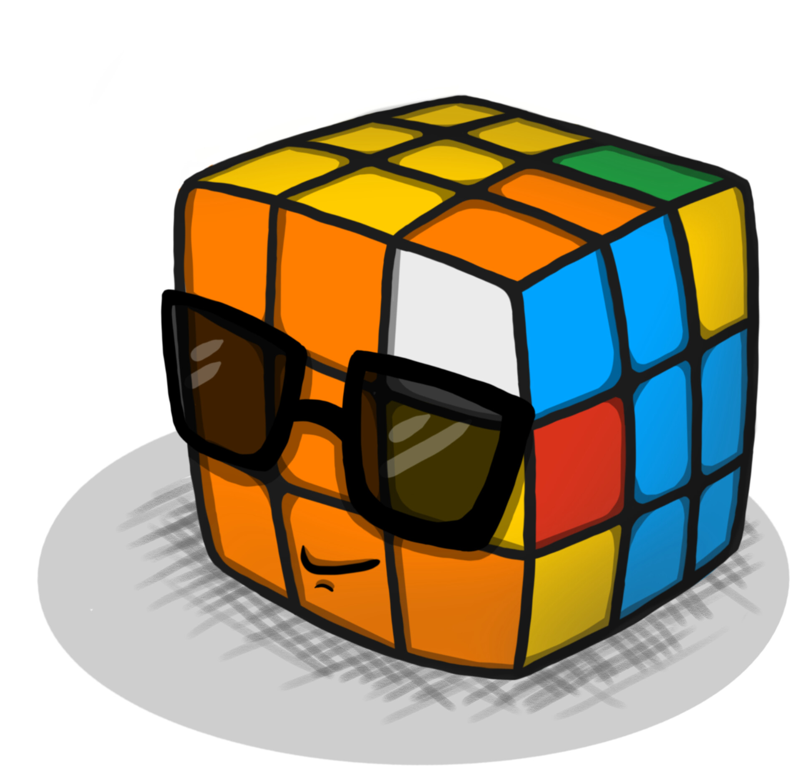

# Exploring Software Engineering

My journey into the realm of software engineering had an unexpected start during my freshman year at UC Riverside. As part of my Electrical Engineering requirements, I found myself enrolled in a coding class. Little did I know that this seemingly obligatory course would spark a passion that would change the course of my academic and professional pursuits. Over the years, I transitioned from Electrical Engineering to Computer Engineering during my time at UH Manoa, a decision influenced significantly by the enjoyment I found in solving coding challenges when assisting my Computer Science friends.

The roots of my interest in software engineering can be traced back even further to the moment I learned to solve a Rubik's cube. This puzzle introduced me to the world of algorithms, and I grew fascinated with problem-solving and the intricate logic behind it. This has grown into a genuine passion for crafting efficient and elegant solutions through coding.

I am most experienced in C/C++, and while I thoroughly enjoy coding in C, I am eager to broaden my horizons by learning more modern programming languages. The prospect of creating apps, coupled with learning new languages, is what I look forward to the most. I envision developing applications that cater to entertainment, services, convenience, and overall enhancement of quality of life. The versatility and adaptability that come with mastering various programming languages will play an important role in achieving this.

Looking ahead, I firmly believe that software engineers are at the forefront of shaping the future, especially in the context of the rising influence of AI and the continuous evolution of technology. The role of software engineering is not just about writing code; it's about creating solutions that address contemporary challenges and improve lives. My aspirations align with this vision, as I am eager to contribute my skills and knowledge to projects that not only entertain but also provide valuable services and enhance the overall convenience and quality of life for users.

My journey from a coding class at UC Riverside to the world of software engineering has been driven by a genuine passion for problem-solving, a love for coding languages like C, and a vision of contributing to the future through the creation of innovative and impactful applications.

  

