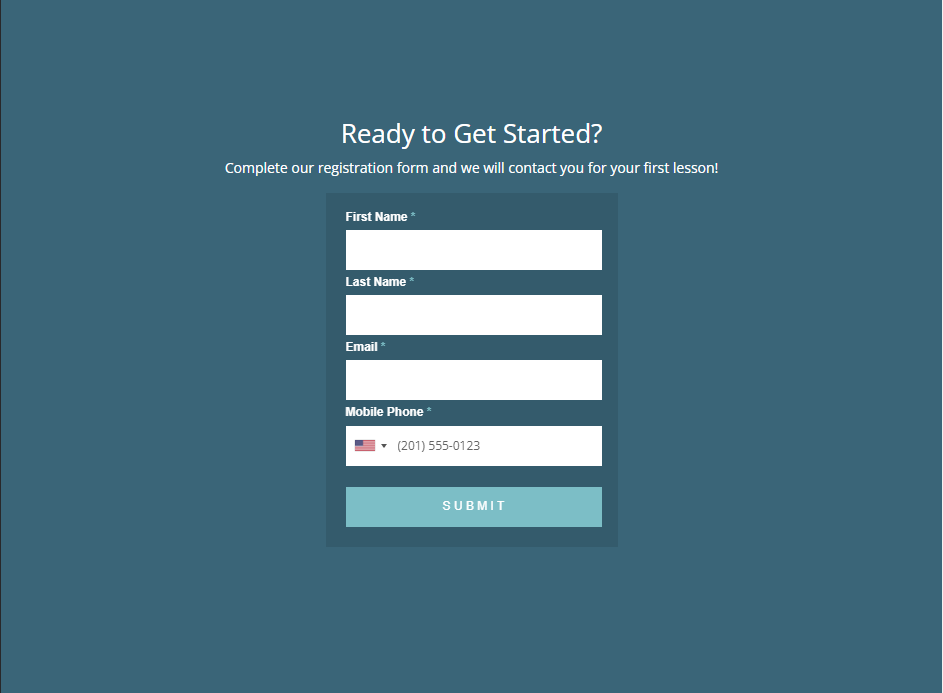
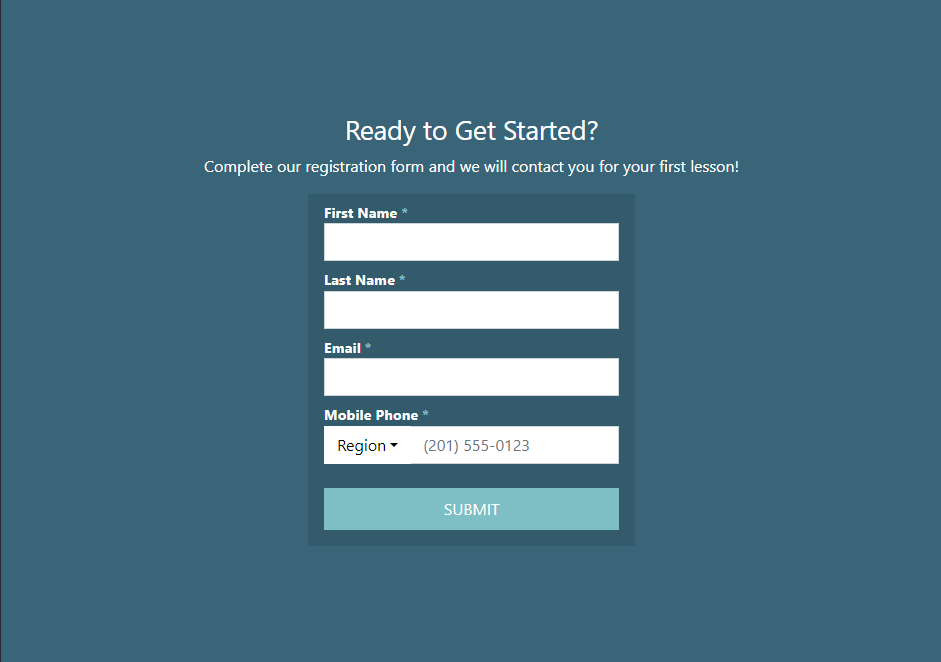
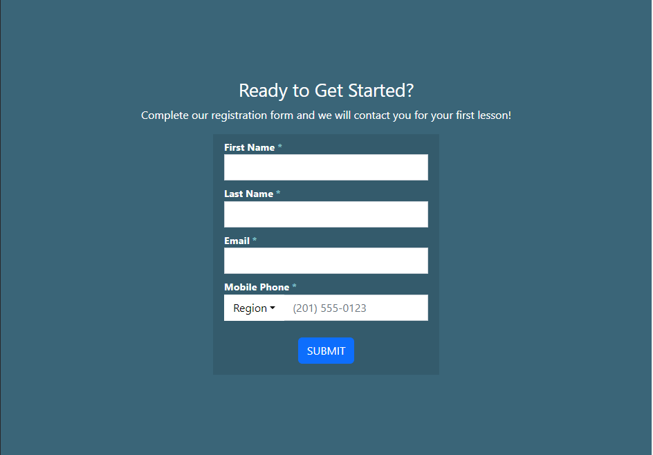

  <h1>Intro</h1>

  

    Before this class, I had very limited experience with HTML and CSS. Using them to create webpages has been a frustrating, but occasionally rewarding experience. HTML code can be an eyesore, as the amount of divs needed to create a nice webpage can be a bit overwhelming. Trying to find the spot where you left off sometimes feels like finding a needle in a haystack. For the past few weeks or so, we have been experimenting with using Bootstrap 5, a UI framework, for designing webpages. My hope was that Bootstrap would simplify the web design process. So far, I have mixed emotions for Bootstrap 5, as some features seem a bit redundant when CSS already exists, while features like the grid system makes laying out the webpage easier.
  

<h1>Limited Customization</h1>

  

    Below (from left to right) is the original webpage form, the form I ended up creating with CSS, and the form when using a Bootstrap button.
  

  

    
  

  

    
  

  

    
  

  

    Notice how the Bootstrap button is a different size and color. I was using a default Bootstrap button class called "btn-primary". I tried for hours to replicate the button using purely Bootstrap elements, but to no avail. I checked if any of the default Bootstrap buttons have a color similar to the one I needed, and to my surprise, there were only 8 colors, and none of them matched the color I needed. In order to use a Bootstrap button, to achieve the look that I want, I had to customize it with CSS, which made me question the point of using Bootstrap elements when replicating a website. I've come to the realization that Bootstrap is more suited for creating websites from scratch, as prebuilt elements could save the user plenty of time. But if you want to achieve a specific design, using Bootstrap alone feels limited.
  

        
  <h1>
    So where does Bootstrap shine?
  </h1>

  

    Where Bootstrap shines best is in the layout department. The most handy feature so far has been the grid system. Using "row" classes and "col" classes for divs made laying out the website more comprehensible. Placing elements directly next to each other is made easy using this system. 
  

    
  

<pre>
  <code>
  <footer class="footer mt-auto py-3" id="bottomMenu">
  

    

      

        Lunch
        

        Monday - Friday: 11:00am - 2:30pm 
        Saturday - Sunday: Not open
      

      

        Bar
        

        Monday - Friday: From 11:00am to closing 
        Saturday - Sunday: Not open
      

      

        Dinner
        

        Monday - Friday: 5:00pm - 9:00pm 
        Saturday - Sunday: Not open
      

    

  

</footer>
</code>
</pre>  

</body>
</html>
