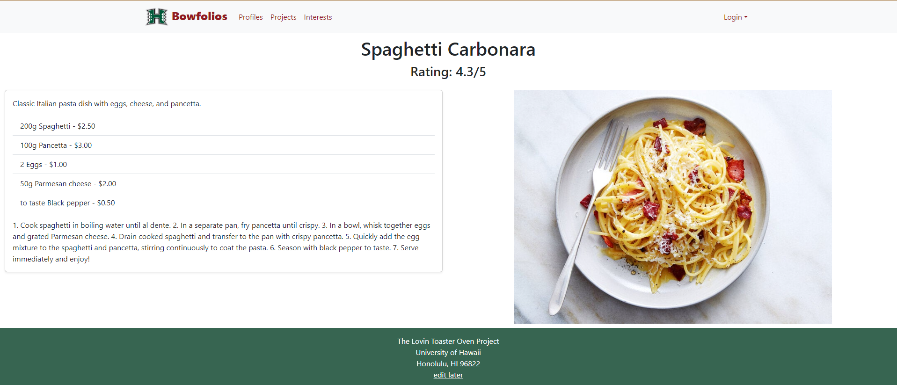
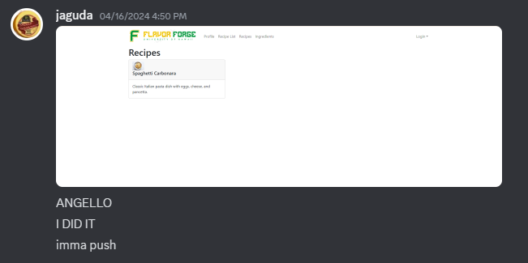

# Flavor Forge

In the Spring 2024 semester, my group of classmates teamed up with the goal of creating a website with budget-friendly recipes for college students. If you want to learn more about the source code and how it works, you can visit our organization's GitHub page at [https://github.com/Flavor-Forge/flavor-forge](https://github.com/Flavor-Forge/flavor-forge).

## Overview

### Home Page

The Flavor Forge homepage is your starting point for culinary exploration. It provides a brief overview of our platform's mission, showcases a featured recipe to inspire your next cooking adventure, and offers easy navigation to other sections of the website.

### Recipe Page 

Each recipe is presented with details including its name, user ratings, description, ingredients, instructions, and a visual representation of the final dish. User's can edit recipes that they created, and other users can give the recipe a star rating from 1 to 5.

### Recipe List Page

Browse through our extensive collection of recipes on the Recipe List Page. Here, you'll find recipe cards featuring dish names, images, and brief descriptions. Use the filter bar to search for specific recipes.

### Profile Page

Make Flavor Forge your own on the Profile Page. Here, you can customize your profile with a picture and details, showcase your culinary creations, and keep track of your favorite recipes.

### Update Profile Page

Keep your profile up-to-date and engaging with the Update Profile Page. Easily edit your information, upload a new picture, and share a bit about yourself with the Flavor Forge community.

### Add Recipe Page

Join our community of food enthusiasts by sharing your own recipes on the Add Recipe Page. Simply fill out the details, upload a picture of your dish, and give it an initial rating to get started.

## My Contributions

- **Recipe Page**: The very first thing that I implemented was a mockup for the recipe page. Here is what it initially looked like when I first got it to work.

- **Navbar**: The next issue that I tackled was the Navbar. At this point we had no way to navigate the page, so it was an essential step towards the functionality of our website.
- **Recipe List Page**: I the implemented the Recipe List Page, which took a bit of time to figure out. Here is a screenshot of the Discord message I sent to Angello Portello, one of my team members, when I finally got it to work.

- **Bug Fixes and Style Changes**: In addition to the two major pages and the navbar, I had many minor contributions to the project in terms of quality control in form of bug fixes and style changes. I also created the testcafe tests to ensure the functionality of our website.

## What I Learned

When working with a team, I learned that leadership and active communication are important aspects of Agile Project Management. When these two elements were absent, the project development became more of a grind than a sprint. Without leadership and communication, issues are assigned on a first come, first served basis, leaving the team members who are more eager to participate to fix most of the issues. Someone with a leadership role, like a project manager, would be able to delegate issues to those who are hesitant to take initiative and pick up new issues. I also learned that when using IDPM as a methodology, it is good practice to frequently push (reasonably) broken code and create a new issue based on that code instead of never pushing your code until it is perfect. In other words, frequent incremental updates are key for IDPM.
